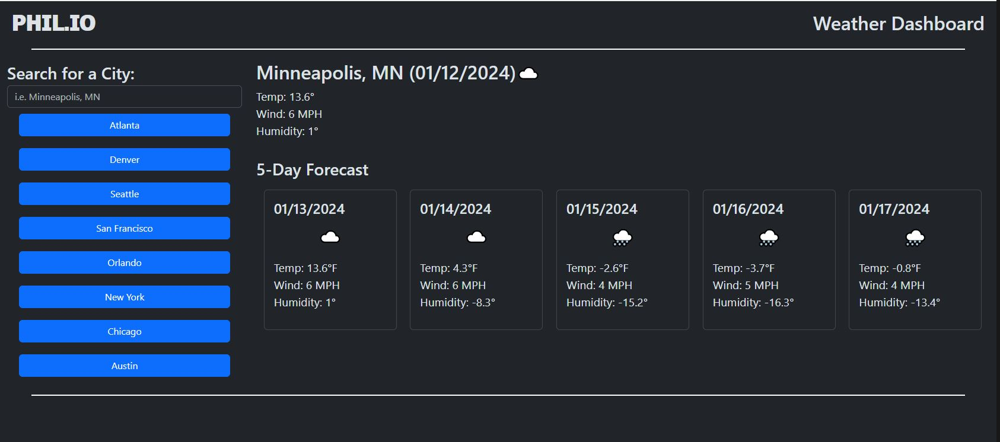

# PHIL.IO
The weatherman app!

## Features
Phil.io allows users to search any city in the United States and return a 5-day forecast.  Everything is dynamically updated and previous queries are stored in local storage.  The sidebar features quicklinks to the largest cities in the US.  Bear in mind that this app is syntax-specific and cities must be spelled correctly followed by a comma and the state code.

## Screenshot

## License
See license file.
